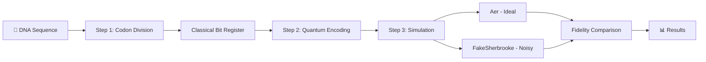
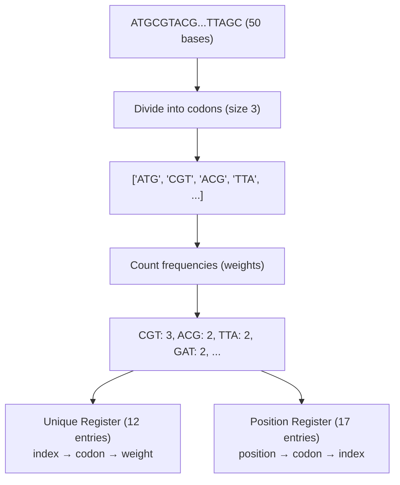
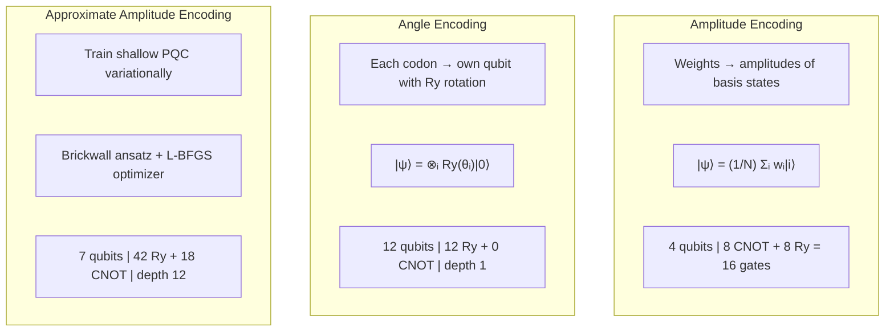
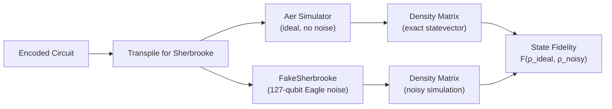
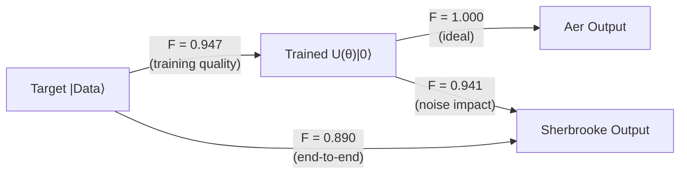

# 🧬 Quantum Encoding of Genetic Information

<p align="center">
  <b>PhysisTechne Symposium 2026 — Quantum Computing Track</b><br>
  <i>Encoding DNA sequences into quantum circuits using three encoding strategies,<br>
  benchmarked on IBM's FakeSherbrooke 127-qubit Eagle processor</i>
</p>

<p align="center">
  
  
  
  
</p>

---

## 📌 Overview

This project implements a complete pipeline for encoding DNA sequences into optimized quantum circuits. DNA is divided into **codons** (triplets), their frequencies are computed, and the resulting weight distribution is encoded into quantum states using three different strategies — each with different qubit, gate, and fidelity tradeoffs.

Two pipelines are provided:

| Pipeline | Entry Point | Encodings | Target Sequence |
|:---|:---|:---|:---|
| **Pipeline 1** | `main.py` | Amplitude + Angle | 50-base sequence |
| **Pipeline 2** | `main_aae.py` | Approximate Amplitude (AAE) | 12,001-base Rhesus macaque chr16 |

---

## 🏗️ Pipeline Architecture

### High-Level Flow



### Step 1 — Classical Bit Register



### Step 2 — Three Encoding Strategies



### Step 3 — Dual Backend Simulation



---

## 🔬 Encoding Strategies

### Amplitude Encoding

Encodes codon weights as **amplitudes of computational basis states**. Uses `initialize()` which decomposes into `2^(n-1)` CNOT gates and `2^(n-1)` Ry rotation gates.

```
|ψ⟩ = (1/N)(w₀|0000⟩ + w₁|0001⟩ + w₂|0010⟩ + ...)
```

| Property | Value |
|:---|:---|
| Qubits | `ceil(log₂(N_unique))` |
| CNOT gates | `2^(n-1)` |
| Ry gates | `2^(n-1)` |
| Encoding | Exact |
| Entanglement | Yes |

### Angle Encoding

Encodes each codon weight as an **Ry rotation angle** on its own dedicated qubit. Weights are rescaled to `(0, 2π]` to prevent information loss.

```
|ψ⟩ = Ry(θ₀)|0⟩ ⊗ Ry(θ₁)|0⟩ ⊗ ... ⊗ Ry(θₙ)|0⟩
```

| Property | Value |
|:---|:---|
| Qubits | `N_unique` (one per codon) |
| CNOT gates | 0 |
| Ry gates | `N_unique` |
| Depth | 1 |
| Entanglement | None (product state) |

### Approximate Amplitude Encoding (AAE)

Trains a **shallow parameterized quantum circuit** (brickwall ansatz) to approximate the target amplitude distribution using variational optimization.

```
U(θ)|0⟩ ≈ |target⟩     minimizing C(θ) = 1 - Re⟨target|U(θ)|0⟩
```

| Property | Value |
|:---|:---|
| Ansatz | Brickwall (alternating CNOT pairs) |
| Optimizer | L-BFGS (quasi-Newton) |
| Training | Statevector simulation (exact) |
| Depth | O(poly(log N)) |
| Scalable | Yes |

**Brickwall Ansatz Structure:**

```
Layer 1:  ─Ry─╥─Ry─╥─Ry─╥─Ry─╥─Ry─╥─Ry─╥─Ry─
               ║    ║    ║    ║    ║    ║    ║
          ─────╨────╨────╨────╨────╨────╨────╨──
          CNOT: (0,1)  (2,3)  (4,5)          [even pairs]

Layer 2:  ─Ry──Ry──Ry──Ry──Ry──Ry──Ry─
          CNOT:   (1,2)  (3,4)  (5,6)        [odd pairs]
```

---

## 📊 Results

### Pipeline 1 — Amplitude vs Angle Encoding (50 bases)

| Metric | Amplitude | Angle |
|:---|---:|---:|
| Qubits | 4 | 12 |
| Logical CNOT gates | 8 | 0 |
| Logical Ry gates | 8 | 12 |
| Total logical gates | 16 | 12 |
| Transpiled depth | 67 | 5 |
| Two-qubit gates (transpiled) | 15 | 0 |
| **F(initial, Aer)** | **1.000** | **1.000** |
| **F(initial, Sherbrooke)** | **0.959** | **0.985** |
| Noise drop | 0.041 | 0.015 |
| Reconstruction | 100% | 100% |

> Angle encoding achieves higher fidelity (0.985 vs 0.959) due to zero two-qubit gates and depth 1, but requires 3× more qubits.

### Pipeline 2 — AAE on 12,001-Base Sequence

| Metric | Value |
|:---|---:|
| Sequence length | 12,001 bases |
| Total codons | 4,001 |
| Unique codons | 65 |
| Qubits | 7 |
| Ansatz layers | 6 |
| Trainable parameters | 42 |
| Logical gates | 60 (42 Ry + 18 CNOT) |
| Transpiled depth | 39 |
| Two-qubit gates (transpiled) | 18 |
| **Overlap O** | **0.973** |
| **F(target, trained)** | **0.947** |
| **F(trained, Sherbrooke)** | **0.941** |
| **F(target, Sherbrooke)** | **0.890** |
| Noise drop | 0.060 |
| Reconstruction | 100% |
| Runtime | 362s |

> 12,001 bases encoded into a **7-qubit, depth-39 circuit** with **89% end-to-end fidelity** on a noisy 127-qubit backend.

### Fidelity Breakdown (AAE)



---

## 📁 Project Structure

```
├── main.py                    # Pipeline 1: Amplitude + Angle encoding (50 bases)
├── main_aae.py                # Pipeline 2: AAE encoding (12,001 bases)
├── requirements.txt
├── LICENSE
│
├── src/                       # Pipeline 1 modules
│   ├── compression.py         #   Step 1: Codon division + classical register
│   ├── encoding.py            #   Step 2: Amplitude & angle encoding
│   ├── simulation.py          #   Step 3: Aer + FakeSherbrooke simulation
│   ├── reconstruction.py      #   DNA reconstruction via classical register
│   └── fidelity.py            #   Fidelity calculations
│
├── src2/                      # Pipeline 2 modules (AAE)
│   ├── compression2.py        #   Step 1: Codon division + target distributions
│   ├── aae_encoding.py        #   Step 2: Brickwall ansatz + L-BFGS training
│   ├── simulation2.py         #   Step 3: Dual backend simulation
│   ├── reconstruction2.py     #   DNA reconstruction
│   └── fidelity2.py           #   Fidelity (target vs trained vs noisy)
│
├── data/
│   └── dna_12000.txt          # 12,001-base Rhesus macaque chr16 fragment
│
└── results/
    ├── summary.json            # Pipeline 1 output
    └── summary_aae.json        # Pipeline 2 output
```

---

## 🚀 Quick Start

```bash
# Clone and setup
git clone https://github.com/YOUR_USERNAME/quantum-dna-encoding.git
cd quantum-dna-encoding
python -m venv venv
venv\Scripts\activate           # Windows
pip install -r requirements.txt

# Run Pipeline 1: Amplitude + Angle encoding (50 bases)
python main.py

# Run Pipeline 2: AAE encoding (12,001 bases)
python main_aae.py
```

---

## 🧪 DNA Sequences

**Pipeline 1 (50 bases):**
```
ATGCGTACGTTAGCGTACGATCGTAGCTAGCTTGACGATCGTACGTTAGC
```

**Pipeline 2 (12,001 bases):**
Rhesus macaque (*Macaca mulatta*) chromosome 16 fragment — `NC_133421.1:91056922-91068922`, gene LOC144335571

---

## 📚 References

1. IBM Quantum Learning — [Data Encoding](https://quantum.cloud.ibm.com/learning/en/courses/quantum-machine-learning/data-encoding)
2. Nakaji et al. — [Approximate Amplitude Encoding in Shallow Parameterized Quantum Circuits](https://doi.org/10.1103/PhysRevResearch.4.023136), Phys. Rev. Research **4**, 023136 (2022)
3. IBM Qiskit — [FakeSherbrooke Backend](https://docs.quantum.ibm.com/api/qiskit-ibm-runtime/fake_provider)

---

## 📄 License

[MIT](LICENSE)
